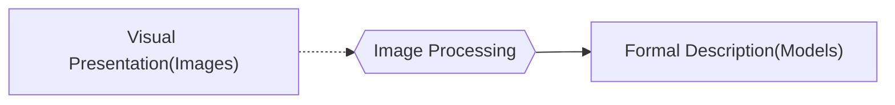

# Computer Graphic_1-1

## Introduction

### Objectives

* To Understand the **fundamental basics** on computer graphics
* To have practical understanding on **rendering pipeline** using **OpenGL**
* To develop implementation skills to make **interactive skills**

### Grading Policy

* Attendance: 10%
* Midterm Exam: 25%
* Quizzes: 10%
* Team Project: 25%
* Homework: 30%

### Book

* "Interactive Computer Graphics:  A Top-Down Approach with shared-based OpenGL (6th edition)"

### Schedule

* Introudction to Computer Graphics (1 week)
* Coordinate System & Transformations ( 2 week)
* 3D Viewing & Clipping (2~3 weeks )
* 3D Modeling & Texturing ( 3 weeks )
* Lighting & Shading ( 1-2 weeks )
* 2D Imaging & Vibility Determination (1-2 weeks)
* Advanced Graphics Programming (1-2 weeks)
* Advanced Redering (1 week)

## General Concept

> * Computer Graphic: **Synthesizing** images from models
>
> * Computer Vision/Image Processing: Understanding/Analyzing Image

### Computer Graphic

> * 아무래도, Comptuer Graphic과 Image Processing은 전부 하나의 tool 내부라고 생각하자! (예를 들어, Unity)
> * Maya를 통해서 만들어진 3-D model Binary 파일을 Unity로 불러와서 Model을 Rendering 해주는 것을 Computer Graphic이 되는 것 이라고 생각이 된다. 
> * Unity 내부에서 redering된 model에 대하여 더 훌룡한 효과(빛 반사, 그림자)를 만들기 위해서 Model 자체에 대해서 분석하는 것이 Image Processing이라고 생각이 된다. 
> * Unity가 빌드가 되어 하나의 Scene으로 만들어지는 것은  Picture Processing으로 생각이 된다.

* **Object**
  * Lines, Pixels, regions, volumes, texts or sets
* **Purpose**
  * Picture Generation

> Input Model이 무엇을 뜻하는가? 설계도 같은 것을 의미하는 건가?

### Image Processing

* **Object**
  * Generated or Scanned Pictures
* **Purpose**
  * Pattern Recognition, Object Recognition, Scene Analysis

> Output Model이 무엇을 뜻하는가? 

### Picture Processing

* **Objects**
  * generated or scanned pictures
* **Purpose**
  * picture enhancement

## Pinhole Camera Model

> [What is a pinhole camera? | Virtual Cameras | Computer animation | Khan Academy](https://www.youtube.com/watch?v=jhBC39xZVnw)
>
> * Pinehole Camera를 배우는 이유는 Synthetic Camera를 이해하기 위해서이다!

### Definition

* **"사물을 명확하게 인식하기 위해서는 Pinehole을 통해 보며, 이때 Pinehole을 통해 그려지는 사물은 거꾸로 보여진다."**

* 우리가 보는 세상은 빛이 물체에 반사되어 만들어지는 반사체(?)를 보는 것이다.

  * 즉, 빛이 없을 때 아무 것도 보지 못하고, 빛이 있을 때, 빛이 물체에 반사가 되어 마치 Projector 처럼 우리 눈에 그려주는 것이다.

* 하지만, 빛은 사방에서 반사가 된다.(그렇기에 우리가 물체를 밝고 명확하게 보는 것) 하지만, 만약 이 반사되어 그려지는 빛을 아주 조그만하게  **Pinhole** 의 크기에 맞게 줄이고 정 중앙에 두고 쏜다면 굉장히 신기한 일이 발생한다~!

  |               |                        |
  | --------------------------------------------------- | ------------------------------------------------------------ |
  | - 빛이 사방에서 온다면 물체는 다음과 같이 그려진다. | - 하지만, 만약 정중앙에 pinhole 을 통해서 빛을 받는 다면, 위 사진과 같이 반대로 그려질 것이다. |

* 결론적으로 사물을 완벽하게 빛을 통해 인식하기 위해서는 **Pinhole** 을 통해서 보는 것이고, 이 방법은 사물을 거꾸로 보게 한다.

### 원리

> "사물을 명확하게 인식하기 위해서는 Pinehole을 통해 보며, 이때 Pinehole을 통해 그려지는 사물은 거꾸로 보여진다."

* **Position을 통한  위치 설정**

  

  * $$(x,y,z)$$ 에 위치한 물체를 Pinehole을 통해서 Image Plane에 그려지는 위치는 $$(x_p,y_p,z_p)$$가 되면, length $$d$$ 를 통해 다음과 같이 위치를 나타낼 수 있다.

  $$
  x_p = -\frac{dx}{z}\\y_p=-\frac{dy}{z}\\z_p=-d
  $$

* **사물을 담는 View Angle(View Field) 구하기** 

  

  * 위 사진과 Image Plane의 $$h$$ 와 pinehole과 image plane의 거리 $$d$$ 알고 있을때, 사물을 담는 view의 angle에 대해서도 구할 수 있다.
    $$
    \theta = 2\tan^{-1}\frac{h}{2d}
    $$

### etc

* **Distacantages**
  1. Too Little light gets in = "적은 빛의 양이니 detail한 것을 놓처, 원근법이 사라진다?"
  2. The angle of view cannot be adjusted = "광각처럼 더 많은 사물 or 배경을 담기에 제한이 된다."
  
* **Pine hole Camera** vs **Lens Camera** 
  * Lens Camera에서는 조리개를 통해서 빛의 양을 조절할 수 있다. 그렇기 떄문에 사진의 심도를 표한할 수 있다.
  * 반대로, Pinehole Camera의. Pinehole의 크기가 고정이기 때문에(빛의 양도 고정?), 모든 사물이 focus되어있다.(Depth 표현이 힘들다.)
  
  
  
  

## Synthetic Camear Model

> Computer Graphic에서 사용되는 Camera Model

### Definition

* 위에서 배웠던, Pinehole Camera를 COP(Center of Projection)라고 하자.
* Camera에 실제 담기는 View와 COP사이에 한 영역을 Projection Plane으로 하자.
* 이때,  Computer Graphic에서는 이 Projection Plance을 기준으로 사물을 담는 Camera Synthetic Camera라고 할 수 있다.

### Property

* Synthetic Camera를 사용하는 이유는 다음과 같다.
  *  Pinehole에서는 image plane의 높이와 pinehole까지의 거리에 의해 angle이 제약 생겼었다. 이것을 없애기 위해서, Synthetic Camera는 Projection Plane의 크기를 조절하며 어떤  사물을 담을 지 정할 수 있는 장점이 있다. 
  * 즉, 제약이 많은 pinehole과 다르게, 더 자유롭게 사물을 image에 담을 수 있다.

## Basic Computer Graphic System

### The Programmer's Model Of Interactive Graphics

> 가장 밑단에서 User까지 오게 되는 간단한 diagram이다.

* Client Programs이 Application Program이다.
* OpenGL이 Graphic System을 담당한다

### Graphic Syste: OpenGL

* OpenGL은  API로 사용이 된다.
  * A software Library for accessing features in graphic Hardware
* Hardware Independence: Cross-Platform Portability
  * 여러 Platform에서 실행이 가능하다.
* A Client-Server Model이다.
  * OpenGL에 API로 요청을 하면.  response하는 개념으로 실행된다.

### OpenGL-Related Libraries

* 다음 부분에 대해서는 OpenGL에서 command를 제공하지 않는다.(제어하기 위해서는 third-party를 사용)
  * Window Tasks
  * Input Devices
  * Complicated Shapes
  * Complex Image Format
* Window System Support Libraries에도 다음과 같은 Graphic Systeme도 있다.
  *  GLX/WGL/AGL/....
* 하지만, 보통.  OpenGL을 사용하기 위해서 다음 2가지를 많이 사용한다.
  * OpenGL Utility Toolkit ( GLUT )
  * OpenGL Extension Wrangler ( GLEW )

### OpenGL Pipeline

* Vertex Shader
  *  Vertex Data는 Vertex Shader(GLSL$$_{\text{OpenGL Shader Language}}$$)를 지난다.
  * 그러면 기본적인  Vertex Geometry를 갖는다. (점)
* Primitive Assenbly
  * Vertex Data의 점들을 Aseemble을 통해 삼각형을 구성한다. (면)
* Rasterization
  * 2-D pixel grid로 변형 시킨다. (pixel)
* Fragment Shader
  * 알고리즘을 통해 각  pixel에 대하여 coloring을 한다. (Color)
* Per-Fragment Operation
  * 각 pixel에 대하여 추가적인 pixel 색 작업으 한 뒤 frame buffer를 완성한다. (Frame Buffer )

