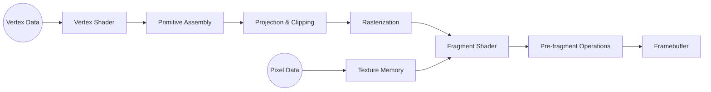

# Computer Graphic_1-2

> ### OpenGL-Introduction
>
> * Rendering
> * Shaders
> * OpenGL's Rendering Pipeline
> * OpenGL Syntax
> * OpenGL Shading Language (GLSL)
> * First OpenGL Program

## Rendering

### Definition

* Automatic process of **generating a photorealistic or non-photorealistic Image** from 2D or 3D models using computer programs.
* Render을 하기 위해서는 당연히(synthesize image), 다음과 같은 정보들이 필요하다.
  * Material properties
  * Light Souces
  * Cameras
  * Motion
  * Texture
  * Shape of Object
  * etc

## Shaders

> Recent Tech

### Definition

* 오늘 날,  CG software에서는 shader를 많이 사용한다.
* Shader는 **user-defined program**으로 **rendering work를 control/modify**하는 기능을 한다.
* run-time efficiency를 위해서 GPU에서 병렬로(excuted in parallel)처리 된다.

## OpenGL's Rendering Pipeline

> * A sequence of stage for converting graphics data into a final image
> * Two required Shader for OpenGL
>   * Vertex Shader
>   * Fragment Shader
> * 이 두개의 shader는 OpenGL을 다루는 programmer가 구현해야 한다.
> * 이 외의 stage는 이미  OpenGL에서 제공해준다.



### Vertex Shader (Basic Shader)

* Vertex Data를 통해 기본 geometry를 얻는다.
* 여기서는 Vertex Data를 가공하는 단계이다.
* GLSL을 통해서 진행
* **점**

### Primitive Assembly

* Vertex를 asseble하여 triangle을 만든다.
* **면**

### Projection & Clipping + Rasterization

* Projection & Clipping
  * 전 lecture에서,  Synthetic Camear Model을 사용한다고 하였다.
  * 이 단계에서는 사물이 Projection Plane에 비춰지는 작업을 담당한다.
* Rasterization
  * Projection Plane에 그려진 사물을 pixel grid로 가공하는 단계이다.

### Texture Memory + Fragment Shader(Basic Shader)

* Texture Memory
  * 사물의 surface imag를 설정할 수 있다.
* Fragment Shader
  * color를 설정한다

### Per-Fragment Operation + Framebuffer

* Per-Fragment Operation
  * Fragment Shader 단계까지 계산된  data를 framebuffer로 옮기는 작업을 한다.
  * 교수님꼐서 예는 다음과 같다.
    * 두개의 서로 다른  object가 존재한다.
    * 한  buffer에 겹치는 경우, 겹치는 것을 표현해야한다.(겹치는 일정 부분은 가려진다는 의미)
    * 이러한 계산을 여기서 하는 것 같다.
* Framebuffer
  * 마지막 image는 framebuffer에 그려진다.
  * 물론, 이 frame buffer가 device에 그려지는 것이 최종 단계이겠지만......

## OpenGL Syntax

### Basic Syntax

* **Constant**
  * Begin with "GL"
  * Ex) GL_COLOR_BUFFER_BIT
* **Functions**
  * Begin with "gl"
  * Ex) glBindVertexArray()
* *OpenGL has no overloaded functions*

### Data Types

* 선언 하기 위한 Type이 정해져 있다
* For more details and types, see https://www.khronos.org/opengl/wiki/OpenGL_Type.

### Function Suffix

*  FunctionName{<\the # of parameters>}{<\Data Type>}{<\Vector>}
* [OpenGL 함수 한글 설명서](https://monochromelux.github.io/opengl/)
*  Note: there are 24 versions of glUniform*(). For more details, see the following link: https://www.khronos.org/registry/OpenGL-Refpages/gl4/html/glUniform.xhtml.

## OpenGL Shading Language (GLSL)

* Shader를 programming하기 위한 언어
* [GLSL/Shader Tutorial 강의](https://www.opentutorials.org/module/3659)

### GLUT(OpenGL Utility Toolkit)

> Support Window Interfaces

* Provides a simple window API for OpenGL
* Old and limited

### FreeGLUT

> Support Window Interfaces

* X-Consortium에서 만듬

### GLEW(OpenGL Extension Wrangler)

> To Load OpenGL Extension

* Cross Platform OpenSource OpenGL Extension Loading Library
* Provides efficient run-time mechanisms for determining which OpenGL extensions are supported on the target platform.

## First OpenGL Program

> <font color ="black">**Assignment_1_Review**를 보는 것이 어쩌면 더 이해가 잘 갈 것이다.</font>

### Sending Vertex Data to OpenGL

* Buffer allocation & Initialization
  * 모든 data **buffer object**에 저장된다.
  * **buffer object**는 OpenGL에서 관리가 된다.
  * **getBufferData()**를 통해서 **buffer object**의 메모리 공간을 확보한다.
* 예시

  ```c++
  GLunit Bufers[1];

  glGenBuffers(1,Buffers);	//buffer object 생성
  glBindBuffer(GL_ARRAY_BUFFER,BUFFERS[0]);	//openGL에서 Binding Target 0번째 GL_ARRAY_BUFFER와 연결
  glBufferData(GL_ARRAY_BUFFER,sizeof(vertices),vertices, GL_STATIC_DRAW); //vetice data를 GL_ARRAY_BUFFER를 통해서 할당된 Buffer Object에 추가한다.
  ```

  * <font color = "red">GL_ARRAY_BUFFER를 따로 관리하는 이유? 왜 직접 Buffer Object List에 추가하지 않는가?</font>
  
*  Request for Rendering

  *  vertice data가 buffer에 옮겨진 것을 알 수 있다.
  * 그렇다면 이제, OpenGL에서 그리는 명령어를 통해서 그려보자.
    * glDrawArray(); accessing buffer elemnents in a **sequencial**
    * glDrawElements();  accessing buffer elemnents in an **indexed order**

### Pass-through Vertex Shader

* Vertex Shader
  * Drawing Command가 호출되었을 때, 실행되는 단계
  * **Pass-through Vertex Shader**는 Vertex Data를 **복사**하여 보내는 작업 중 간단한 작업이다. 

### Fragment Shader for coloring

* Rasterization에서 만들어진 frame에 대하여 색을 부여하는 단계
  * Rasterization: Projection Plane에 그려진 사물을 pixel grid로 가공하는 단계이다.

## 예시

* ./triangle.cpp

### 환경 구축

```zsh
#glut 설치
brew install glut
# 만약 xquarz 관련 error 가 뜨면 아래 cmd 실행
brew cask install xquartz

#glew 설치
brew install glew

```

