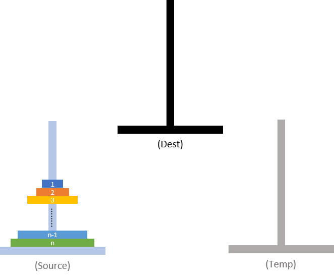
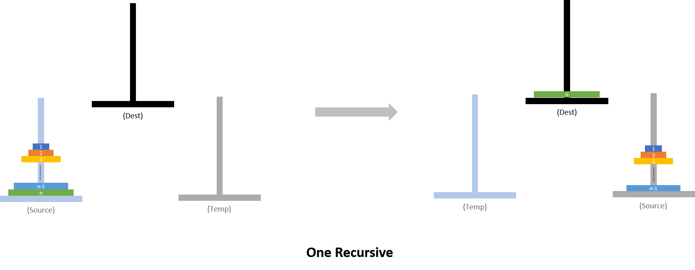

# Hanoi Tower

## Problem

* 세 개의 장대가 있고 첫 번째 장대에는 반경이 서로 다른 n개의 원판이 쌓여 있다. 각 원판은 반경이 큰 순서대로 쌓여있다. 이제 수도승들이 다음 규칙에 따라 첫 번째 장대에서 세 번째 장대로 옮기려 한다.
  1. 한 번에 한 개의 원판만을 다른 탑으로 옮길 수 있다.
  2. 쌓아 놓은 원판은 항상 위의 것이 아래의 것보다 작아야 한다.

* 이 작업을 수행하는데 필요한 이동 순서를 출력하는 프로그램을 작성하라. 단, 이동 횟수는 최소가 되어야 한다.

## Method

### Idea

<center></center>

> n개의 원반이 존재한다. 

1.  Source 기준 막대에서 n번째를 재외한 나머지 원반을 Temp 임시 막대로 옮긴다.
2.  n번째 원반을 Dest로 옮긴다.
3.  Source 막대와 Temp 막대의 역할을 바꾸고 다시 1번으로 간다.

### 점화식

* Hanoi Tower에서 최소한으로 이동하는 횟수를 점화식으로 나타낼 수 있다.
  $$
  T_n=2^n-1
  $$

### 핵심

> * 왼쪽은 n번째 원반 관점에서의 막대 Role
> * 오른쪽 그림은 n-1의 관점에서의 막대 Role

<center></center>

* 막대의 역할 (n-1번째 관점)
  * Source: n번째 원반이 Dest 막대로 원반이 옮겨지고 난 후, 나머지 원반이 위치한 막대 
  * Temp:  n-1번째를 제외한 옮겨져야 하는 나머지 원반이 위치해야하는 막대
  * Dest: n-1번째 원반이 위치할 막대
* 관점의 차이
  * **Recursive의 특징은 주인공이 항상 바뀐다는 것이다(Don't Confuse).**
  * 우리는 n 번째 원반을 dest 막대로 옮기기 위해서 n번째 원반을 제외한 막대를 임시 막대로 옮긴다.
  * 이 때, 옮겨 질 때의 원반들(나머지 원반)의 dest는 임시 막대가 되는 것이다. 즉, 검은 막대 또한  임시 막대로 사용 될 수 있는 것이다.

### 함수 설계

* Function Hanoi
  * Function Hanoi는 원반을 Source 막대로 부터 Dest 막대 까지 옮기는 함수이다.
  * 고로, 각 막대를 parameter의 role에 알맞게 정해주면 된다.

* Hanoi Tower가 Recursive로 구현 되기 때문에 구지 문제의 2번째 rule을 구현할 필요가 없다.
  * 그 이유는, recursive를 설계할 때, 항상 가장 낮은 원반인 1번 부터 옮길 것이기 때문이다.
* 또한, Recursive이기에 구지 data를 저장 하지 않고 바로바로 출력 할 수 있다.

## Code

```c++
#include <cstdio>
#pragma warning(disable:4996)

using namespace std;


void Hanoi(int n, int tmp1, int tmp2, int dest) {


	if (n == 1) {
		cout << from << " " << to << endl;
	}
	else {
        //moving n-1 of disk from tmp1 to tmp2
		Hanoi(n - 1, tmp1, dest, tmp2);
        
        //log of movement
		cout << from <<" "<< to << endl;
        
        //moving n-1 of disk from tmp2 to local dest
		Hanoi(n - 1, tmp2, tmp1, dest);
	}
	return;
}


int main() {
	int N;
	scanf("%d",&N);
	Hanoi(N, 1, 2, 3);


	return 0;
}
```


## Ref

* [기계인간 John Grib- 하노이의 탑](https://johngrib.github.io/wiki/tower-of-hanoi/)
* [Wiki-하노이 타워](https://ko.wikipedia.org/wiki/%ED%95%98%EB%85%B8%EC%9D%B4%EC%9D%98_%ED%83%91)