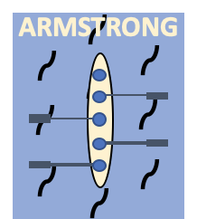

# Armstrong

> In Progress

### Concept

	

* 2번째 Project는 Unity를 사용하여 개발할 조정 게임이다. 
*  조정의 Key point는 화합이다. 여러명의 선수가 Catch와 finish 그리고 recovery를 정확하고 동일한 pace로 가져가야 배가 올바르게 나아갈 수 있다.
* **Timing을 동일하게 가져오는 것을 재미 point로(기술) 조정(관점)에서 재해석 할 수 있을 것 같다.**

### Env

* Unity

