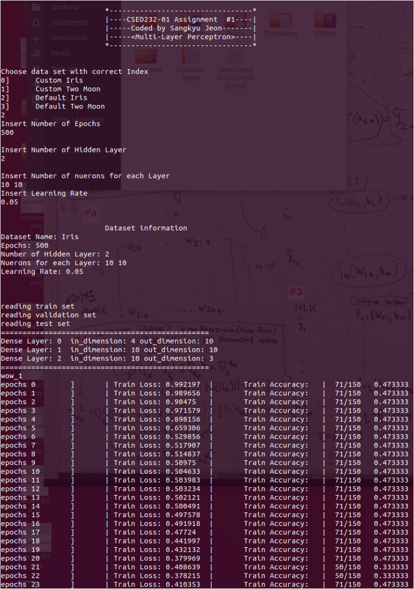
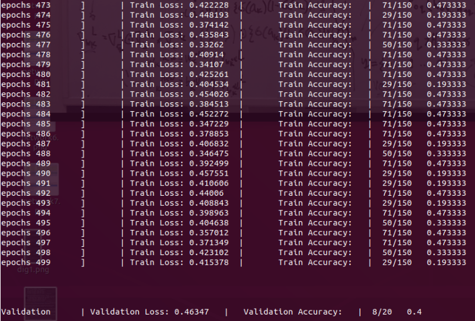
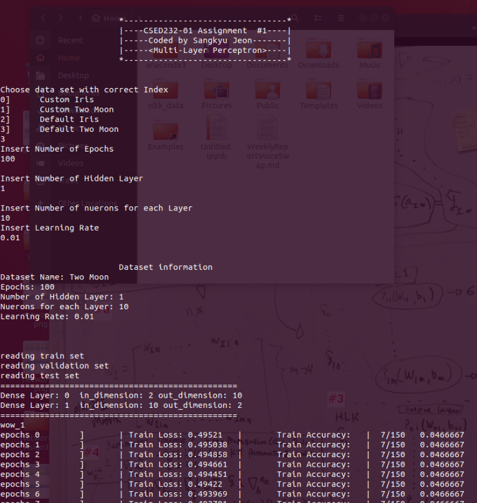
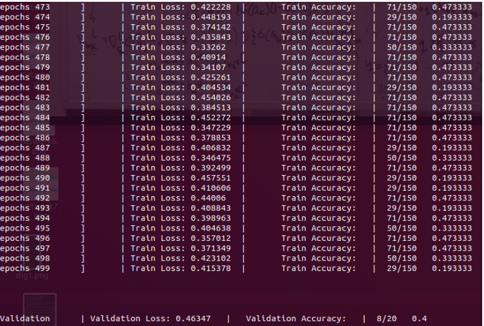
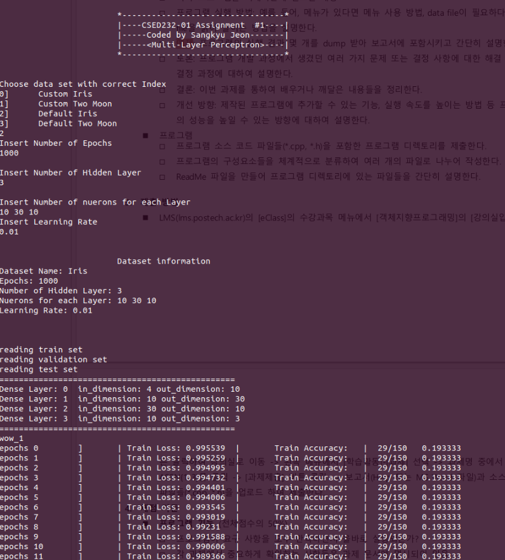
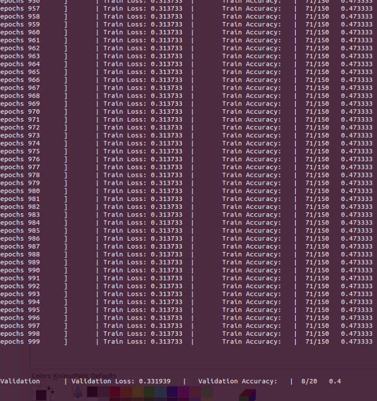

# Multi-layer Perceptron

>  Multi-Layer Perceptron 구축
>


## 개요

1.  Object
2. Algorithm
3. 프로그램 실행 방법
4. 예제
5. 토론 및 결론
7. 개선 방향


## Object

* 본 과제에서는 Multi-Layer Perceptron을 구현하여 Two Moon Dataset 과 Iris Dataset 들을 학습하고 결과를 산출한다. 이를 통해 C++의 다양한 Class 기법을 연습한다
* 더 자세항 설명은 다음 [링크](../ai/2019/10/13/MLP.html)를 참고하여라.


## Algorithm

<center>
	
</center>

>그림을 통해서 설명하겠다.

### #1

* 먼저, dataset으로 부터 읽어온 $$x_i$$ 값을 hidden layer로 보낸다
* Hidden layer에서는 미리 random으로 설정해 놓은 weight와 bias값들이 존재한다. 이 $$x_i$$는 weight과 bias들을 통해 **activation function**을 만든다.
* 다시, 이 activation function은 **sigmoid function**을 통해서 신경망 내에서 인식이 가능한 **신호**로 변환시킨다
  * 신호를 세분화하여 그 값을 조정하는데 sigmoid function이 사용되었다.
  * 하지만 찾아보니 ReLU 함수로 하면 더욱더 정확한 학습을 실시할 수 있다고 한다.
* 여기까지가 perceptron이 하는 일들이다. 

### #2

* 사전에 Hidden Layer의 갯수와 각 layer의 perceptron 갯수를 정했을 것이다. 
* <#1>에서 일어난 일들을 이제, Hidden Layer을 통해 더 다양한 신호를 변환하며 layer를 넘어간다.

### #3

* Output Layer에서는 **classification**을 위해 hidden layer에서 분류되면서 바뀐 신호를 종합하여 class 수에 맞게  output $$\hat{y}$$을 만든다.
* 출력층에서는 여러가지 방법으로 $$\hat{y}$$를 표현 가능하다.
  * 회귀에는 항등 함수를 통해 그 값 그대로 출력을 할 수 있다.
  * Two Moon 처럼 2개의 class 뿐인 경우, Sigmoid 값을 통해 출력을 할 수 있다
  * Iris 처럼 다중 class는 **softmax**를 통해서 사용이 가능하다.
* 출력층의 Output $$\hat{y}$$를 통해서 가장 큰 값의 class를 정답으로 선택한다

### #4

* label를 통해서 정답과 오답을 알 수 있다.
* label $$y$$과 output $$\hat{y}$$를 변수로 갖는 **Loss Function**을 **편미분**하여 학습이 가능하다.
  * Loss Function을 설정하는 이유는 정확도를 높이기 위함이다
  * 최적의 매겨변수를 탐색할여 Loss Function 값을 작게 할 수 있다.
  * 이때 이 매개변수가 **Hyper Parameter**인 것이다.
  * 그리고 이 방법이 바로 편미분을 통해서 이루어 진다.
* Output Layer의 Loss Fucntion을 $$\hat{y}$$에 대하여 편미분하여, 그 값이 최소가 되는 Parameter를 찾는다
* Hyper Parameter를 찾게 되었다면, 해당 layer의 parameter를 $$\eta$$에 곱하고 빼준 뒤 Update 시켜준다.

### # 이렇게 한번의 Epochs

* 이렇게 되면 한번의 epochs가 끝난다. 
* 사용자가 설정한 epochs의 값, learning rate, hidden layer와 neurons 갯수를 통해서 지속적인 학습을 하게 된다.


## 프로그램 실행 방법

1. Makefile을 실행하자

   * ```make```는 file들을 build를 하고, ```make clean```은 build된  Object 파일 및 실행 파일을 없앤다

   ```
   (base) kyu@kyu-0929:~/Desktop/19-2_Note/OOP/Assignment/Asign1/code$ make clean
   rm -f *.o
   rm -f main
   (base) kyu@kyu-0929:~/Desktop/19-2_Note/OOP/Assignment/Asign1/code$ make
   g++    -c -o Loss.o Loss.cpp
   g++    -c -o Layer.o Layer.cpp
   g++    -c -o Dataloader.o Dataloader.cpp
   g++    -c -o Mlp.o Mlp.cpp
   g++    -c -o main.o main.cpp
   g++ Loss.o Layer.o Dataloader.o Mlp.o main.o -o main
   ```

2. ```./main```을 실행 시켜라

   ```
   (base) kyu@kyu-0929:~/Desktop/19-2_Note/OOP/Assignment/Asign1/code$ ./main 
   
   
   			*---------------------------------*
   			|----CSED232-01 Assignment  #1----|
   			|-----Coded by Sangkyu Jeon-------|
   			|-----<Multi-Layer Perceptron>----|
   			*---------------------------------*
   
   
   Choose data set with correct Index
   0]	Custom Iris
   1]	Custom Two Moon
   2]	Default Iris
   3]	Default Two Moon
   
   ```

   > * 0번은 Iris dataset을 사용하는 경우이다. custom이기 때문에, 기본  value를 설정해주어야 한다.
   > * 1번은 Two Moon dataset을 사용하는 경우이다. 같은 방버으로 기본  value를 설정해주어야 한다.
   > * 2번은 Irisi dataset을 사용하는데, 기본 value가 설정되어 있기 때문에, hidden layer, neuron 갯수, epochs, learning rate만 설정하면 된다.
   > * 3번은 Two Moon dataset을 사용하는 것으로 마찬지로 기본 value가 정해져 있다. 
   >
   > (2번 혹은 3번을 권장한다)

3. 학습 및 검증 그리고 Test가 끝났다

   * Test의 결과가 적힌 경로를 확인 할 수 있을 것이다

## 예제

### Condition

| Epochs | Learning Rate ($$\eta$$) | Hidden Layer 개수 | Neuron 개수(Perceptron) |
| ------ | ------------------------ | ----------------- | ----------------------- |
| 100    | 0.01                     | 1                 | 10                      |
| 500    | 0.05                     | 2                 | 10,10                   |
| 1000   | 0.01                     | 3                 | 30,100,30               |
| 1000   | 0.03                     | 2                 | 100,100                 |


| Irisi Dataset 2 번째 예제                                    | 결과                                                         |
| ------------------------------------------------------------ | ------------------------------------------------------------ |
|  |  |

| Two Moon Dataset 1 번째 예제                                 | 결과                                                         |
| ------------------------------------------------------------ | ------------------------------------------------------------ |
|  |  |

| Irisi Dataset 4번째 예제                                     | 결과                                                         |
| ------------------------------------------------------------ | ------------------------------------------------------------ |
|  |  |


> * 첫번째 예제와 두번째 예제의 조건은 어떠한 Dataset에서도 만족스러운 학습능력을 보여주었다.
> * 하지만 반대로, epochs와 상관 없이 Layer가 많아지고 세분화가 되면 될 수록, 후반에서는 학습이 잘 이루어지 않았다
> * 예상이 되는 것은 부적절한 learning rate와 layer 갯수 이다. Iris나 Two Moon의 class Num은 3개 그리고 2개 이며 각각 feature num도 4개 2개이다. 근데 이것을 한 layer의 100개의 perceptron이 존재하는 layer를 여러번 간다고 한다면, 그 신호($$\hat{y}$$ )의 값이 모호해지는 것으로 예측이된다. 그래서 학습의 효과가 좋지 않다.
> * 반대로 Layer가 1이고 perceptron의 갯수가 10개 일때 (Learning rate는 0.01)일 때 학습이 가장 좋았다. 첫번째 예제와 달리 epochs를 1000번으로 올리면 이때는 학습을 확실히 하여 그 정확도가 0.966 그리고  train loss가 0.03까지 증가하고 감소한다. (다음 그림이 이 예시이다)
>   * epochs는 가능한 충분히 돌려야 한다. 
>   * 또한 learning rate 0.05올리면 accuracy값이 감소하고 train loss가 증가했다....Learning rate 또한 중요하다.


## 토론 및 결론 그리고 개선 방향

### 토론

* 느낀 점
  * 과제가 굉장히 만족스러웠다. 난이도는 굉장히 얼려웠다. 하지만 그 만큼 찾아보고 구현하고 특히 학습이 되는 시점에서는 굉장히 희열을 많이 느꼈다. 
  * 정말 Data를 통해서 학습이 되면 loss function의 감소와 정확도가 올라가는 것을 볼 수 있어서 굉장히 흥미로웠다.
  * 다만, 한계점이 보이는 것이 너무 아쉬었다. epoch가 어느 기점을 넘으면 학습의 의미가 없다. 예상하는 바로는 Dataset이 적어서 그런것이 아닌가 싶다. 물론 data가 많아진다고 해서 꼭 해결 될 것 같지는 않다. Feature의 수는 4개이고 class 수는 3개인 iris Data에 layer를 구지 3개 , 그리고 각각의 neurons를 10,30,10 씩 너무 많이 나눠지 않았나 싶다.
  * 오히려 Iris dataset은 layer가 1개이고 neurons가 10개인 상태에서 적당히 100개 정도의 epochs를 돌리때가 가장 결과값이 좋았다.
  * 또한 처음에는 loss function 값과 상관 없이 accuracy가 높으면 좋은 줄 알았지만,  Two Moon 처럼 class가 애초에 적은 dataset에서는 오히려 loss function이 중요하다는 것을 알 수 있었다.
* 행렬 식 직접 구현
  *  Transpose 그리고 Matrix Product를 함수를 직접 구현하여 사용했다.
  * 행렬 혹은 Vector의 구현은 전부 2차 배열을 통해서 구현하였다.
  * 구현이 어렵다고 하기보다, 그 행렬 혹은 Vector의 크기를 파악하고 계산하는데 굉장히 햇갈렸다.
  * 하지만 성공적으로 사용할 수 있었다.
* -nan 문제
  * softmax 함수를 구현은 했지만, 그 활용이 sigmoid로 대체가 될 수 있어서 적용을 시키지는 않았다. 다만 이 함수를 구현을 할때, Overflow현상으로 -nan을 출력하곤 했다. 이것을 해결하기 이해 가장 큰 수에서 나머지 수를 뺀 값을 통해 계산하여 Overflow를 막는 기법을 배웠다.
* Label 문제 해결
  * 모든 결과 값이 산출이 되고 학습이 되고 나서 test.txt의 결과를 보았을 때, 문제를 발견했다. Iris dataset에 대해서는 label 1~3  까지이고, 반대로  Two Moon의 dataset에서의 label 범위는 0~1이 이었다.
  * 이 문제를 해결하기 위해서 Iris와 Two Moon을 구분하여, 변수 label 값을 한번더 정리하여 저장했다. Iris같은 경우, label-1의 위치에 1 값을 넣었고,  Two Moon은 그대로 해당 위치에 저장했다.
* float 비교
  * 맨 처음 tokenizer를 통해 txt의 각  line을 읽을 때, float로 값들을 읽었다. 문제는 label의 위치를 파악할때, 그 값이 1이 아닌 1.0f으로 설정이 되어 있기 때문에 "==" 로 비교가 불가능하다는 사실을 나중에 파악했다.
  * label의 성질은 one-hot coding으로 되어 있기 때문에, 정답의 class를 제외한 나머지 class에는 0을 할당 받게 설정 해놓았다. 고로, 1.0f을 갖는 값을 찾기 위해 0.5f보다 큰 값을 갖는 위치를 찾음으로 이 문제를 해결 했다.
* Hyper Parameter 구하기
  * 아직 100% 이해를 하지 못한 부분이라면 아마도 편미분을 통해서 매개변수가 가장 작아지는 값을 구하는 방버이다. 정확히 gradient를 통해서 무엇을 나타내고 learning rate를 적용시켜 뺐을때, 어떤 원리로 모델이 더 근접한 값에 도달하는지 완전한 이해를 하지 못했다. 
  * 하지만 주어진 식을 구현하여 결과값을 반환하나는데는 큰 무리없이 구현 할 수 있었다. 이 부분은 꼭 배우고 싶다.

### 결론

* 전체적인 그림에서
  * Dataset 마다 올바른 learning rate, epochs 값, layer 그리고  neuron 갯수가 존재 한다. 더 깊게 들어가서는 어떤 함수를 사용할 건지에 그 결과 값이 달라진다. Epochs를 충분히 돌리면 해당 모델이 학습 가능한 최대치 까지 학습이 가능하지만, 충분 이상의 횟수를 돌리는 경우 특정 시간 부터는 그 계산들이 무의미 해진다. 또한 편미분을 통해서 Update하는 hyper parameter에서, loss function의 값이 작아지는 parameter를 update하는 것이 학습이라는 것을 이번 Assignment를 통해서 배울 수 있었다.
* 세세한 그림에서
  * 내부에서 코딩을 위한 내 실력이 부족하다는 것도 배웠다. 먼저 C++을 처음 사용하는 것이라 여러개의  cpp를 통합하여 사용하는 방법과, header file 작성법 등등 기본적인 지식이 부족했다. 하지만 이번 Assignment를 통해서 생각 보다 많은 부분을 얻어갔다. Makefile을 작성법, Object선언, data관리, object와 object사이의 관계에 대한 이해 등등, 좋은 학습이었다.
  * 또한, 가독성에 대한 아쉬움도 조금 존재한다. 내가 짠 코드이지만, 다른 이들이 보았을때 단번에 이해할 수 있을까하는 걱정이다. 최대한 불필요로하는 code는 지우고 오해가 되는 code도 지웠으나 누군가가 읽을 때 이해하지 못한다면 그 code는 의미가 없을 것이라는 배웠다. 그렇다고 가독성을 위해 comments를 전부 다는 것이 오히려 이해를 돕지 않을 것 같다는 것도 배웠다. 명확한 변수명과 함수명이 필요로한다는 것도 배웠다.

### 개선 방향

* 실제로 MLP를 공부하면서 <밑바닥 부터 시작하는 딥러닝> 책을 많이 참고 했다. 그러면서 Softmax함수라던지, ReLU 함수그리고 Cross Entropy Function에 대해서도 배우고, Hyper Parameter를 구하기 위해서 gradient를 직접 구현하고 적용시키는 내용일 읽었다.  이 과제에서는 실제로 편미분을 사용했다기 보다는 각 Value에서의 방향을 구하는 방법으로 구현을 하였다. 조금더 정교한 함수를 통해서 구현한다고 해서 그 학습이 엄청난 변화를 가져오지 않을 것이라 예상은 되지만, 구현해 볼 필요는 있다고 생각한다
* 변수를 너무 과다로 사용한 감이 있다. 예를 들면, object가 고유로 갖을 필요가 없는 값들, 즉 method에서만 사용될 변수값들을 구지 class의 변수로 선언해서 갖고 있는 경우가 있었다. 이런 부분은 다른 개발자가 읽을 때 분명 오해를 줄 수 있는 소지라고 생각된다. 이런 부분을 개선해야한다.
* Loss Function에 대한 그래프나 Accuracy에 대한 그래프가 없는 것이 아쉽다. GUI Library를 사용하여 학습에 관한 data를 더 쉽게 이해할 수 있는 그래프가 필요로 할 것이다.

---

### Ref

* [LOVITxDATA SCIENCE]([https://lovit.github.io/machine%20learning/2018/04/27/synthetic_dataset/](https://lovit.github.io/machine learning/2018/04/27/synthetic_dataset/))
  * soydaya, 복잡한 인공 데이터 생성을 위한 함수들.....**Skit-Learn**
* [편미분과 Gradient의 기하학적 의미](https://www.youtube.com/watch?v=bUNqn1G1O7E)
* [Khan: ChainRule](https://www.khanacademy.org/math/ap-calculus-ab/ab-differentiation-2-new/ab-3-1a/v/chain-rule-introduction)
* [Matrix의 기본 지식](http://researchhubs.com/post/maths/fundamentals/basic-of-matrix.html)
* [하마다드 곱: $$\odot$$](https://en.wikipedia.org/wiki/Hadamard_product_(matrices))
* [Matrix의 곱]([https://ko.wikipedia.org/wiki/%ED%96%89%EB%A0%AC_%EA%B3%B1%EC%85%88](https://ko.wikipedia.org/wiki/행렬_곱셈))
* [1-07. Multi Layer Perceptron 총정리](https://eungbean.github.io/2018/08/26/udacity-107-MLP-Reminder/)