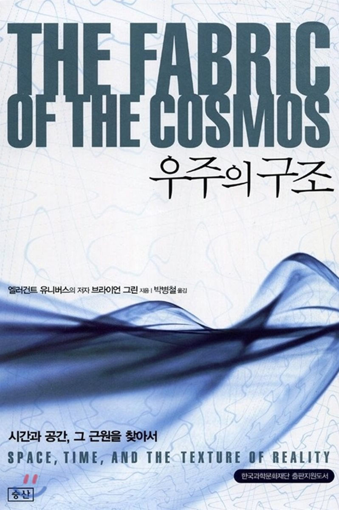

# 우주의 구조$$_\text{The Fabric Of The Cosmos}$$

	

### 저자: 브라이언 그린

``우주의 구조``는 세계적인 물리학자 브라이언 그린$$_\text{Brian Greene}$$이 쓴 책이다. 그린은 하버드 대학교를 졸업하고 옥스퍼드에서 학사 학위를 받았다. 1990년에 코넬 대학에서 교수로 부임했으며 현재는 콜롬비아 대학에서 수학과 물리학을 가르치는 교수로 활동하고 있다. 그린은 ``우주의 구조`` 말고도 ``엘러건트 유니버스``라는 책도 출간하였으며, ``엘러건트 유니버스``는퓰리처상 최종 후보에도 오르기도 했었다. 

### 개요

### 프로젝트 개요

프로젝트 ``우주의 구조``는 우주에 대한 기본적인 지식과 개념을 얻기 위한 목적으로, 독서 후 각 chapter 마다 핵심을 요약하고 필요시 관련 개념들을 기록하는 목표를 갖고 있다.  총 16장으로 이루어져 있으며 한달에 한 장을 요약하는 것으로 목표하고 있다.

시작 일: 2021.03.06

목표 마감일: 2022.06.30

### 목차

#### 진리의 각축장

- [x] 제 1장: 진리로 가는 길

- [x] 제 2장: 회전하는 물통과 우주

- [ ] 제 3장: 상대성과 절대성

- [ ] 제 4장: 얽혀 있는 공간

#### 시간과 경험

- [ ] 제 5장: 얼어붙은 강

- [ ] 제 6장: 우연과 화살

- [ ] 제 7장: 시간과 양자

- [ ] 제 8장: 눈송이와 시공간

#### 시공간과 우주론

- [ ] 제 9장: 증발된 진공

- [ ] 제 10장: 빅뱅의 재구성

- [ ] 제 11장: 다이아몬드를 가진 하늘의 양자

#### 근원과 통일

- [ ] 제 12장: 끈 위의 세계

- [ ] 제 13장: 막 위의 우주

#### 실체와 상상의 세계

- [ ] 제 14장: 이상과 현실

- [ ] 제 15장: 순강이동과 타임머신

- [ ] 제 16자이 암시적인 미래